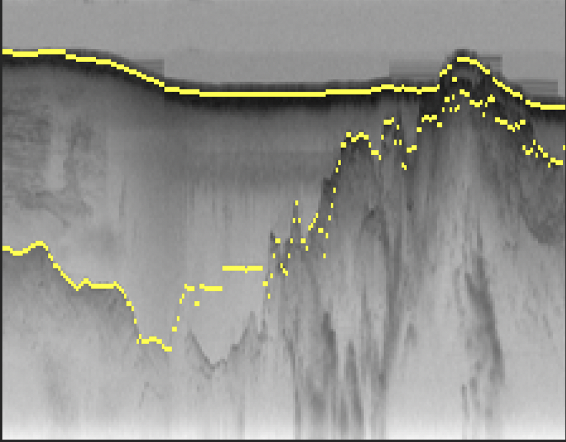
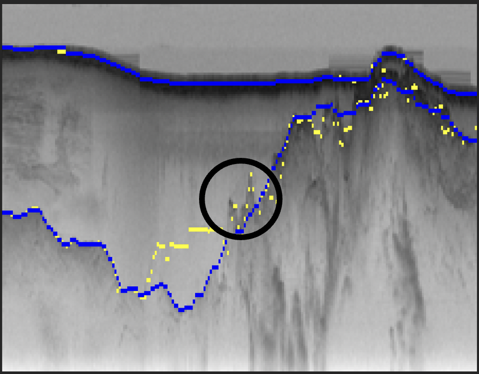
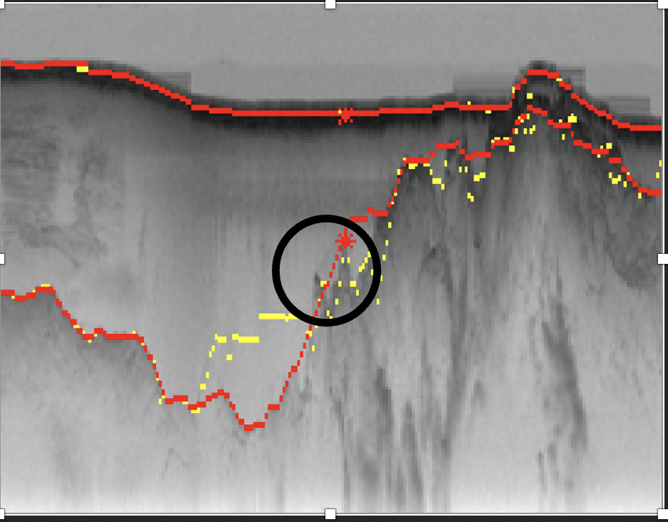
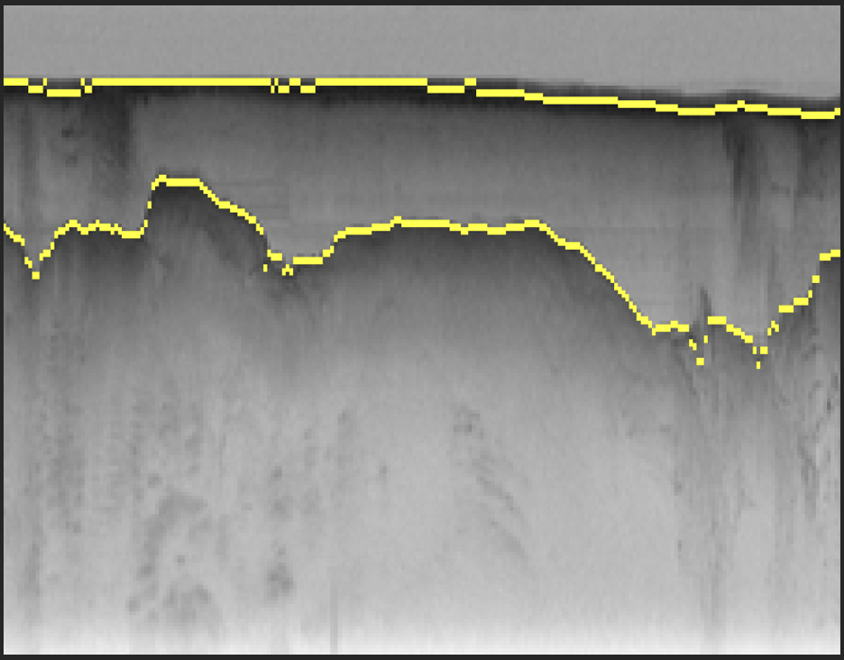
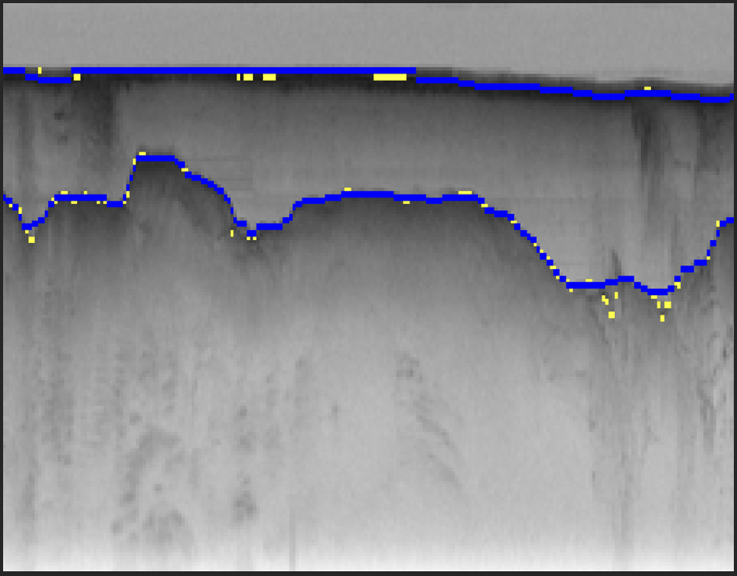
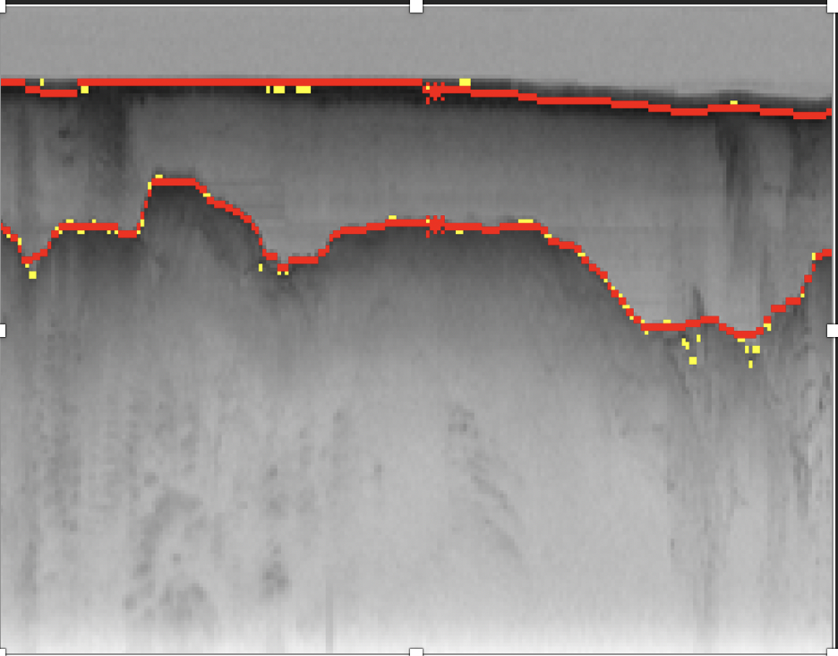

## How I formulated my program:

In the case simple bayes net implementation I simply multiplied the prior with the likelihood to get the posterior.

I consider the prior to be the edge strength and to normalize to get the accurate probability I divide it by the pixel strength from Image array.

In the case Viterbi and Viterbi using human feedback the transition probability is considered with the inverse of the distance. As in if the previous pixels distance from the current pixel is 1/(abs(current_index – previous_index) + 1). 

Also to get a smoothening line a threshold of 3 pixels above and below the current pixel are considered.

## Brief description of how my program works:

In the case of simple bayes net for more obtaining more accuracy I computed the index of the 2 boundaries keeping the assumption that both the boundaries for a particular column has a difference of 10 pixels. 

After finding the bound of the first pixel of each boundary, I calculate the rest of the boundary pixels by keeping this as reference.

The code for the human feedback runs under the assumption as provided in the assignment question that is the row coordinate of the ice-bedrock boundary is 10 pixels greater than the air-ice boundary pixel for that column.

In the case of HMM Viterbi implementation, since the air-ice boundary has a darker line compared to the ice-bedrock boundary, the air-ice boundary is first predicted and lager keeping the air ice boundary as the index the ice-bedrock boundary is predicted.

Her in Viterbi, for the transition state I’m only considering the 3 pixels before and 3 pixels after the current pixel. This is basically done to get better smoothness of the line. And also, the transition probability decreases if the distance from the current pixel increases (The weight is considered to be inverse of distance)

In the case Viterbi using human feedback, considering the provided coordinates as index the boundaries after the point and the boundaries before the points are calculated. The thought process behind using this way is that it will take into the consideration the missing point and include that in the backtracked list to get a better boundary. This is clearly explained from the pictures below.

Below are the few outputs of the problem.

## Fig 23:

This is Simple Bayes Net implementation and we could see that the yellow boundary lines are very discrete and they are not really smooth along the boundary line.

Here using a Viterbi algorithm it provides better result than the simple Bayes net but from the round marker you can see that some minute boundaries are not predicted properly.

Now using human feedback-coordinates :

For Air-Ice boundary providing human feedback coordinates of (38,118) and Ice-Bedrock boundary providing human feedback coordinates of (81,118)

Here it comparatively performs better than just the Viterbi as the human feedback point considers the boundaries that were missed.

## Fig 30

This is a simple Bayes net implementatio for Fig30.

This is viterbi HMM  implementation for Fig 30 consisting a better smoothened line.

Now using human feedback-coordinates :

For Air-Ice boundary providing human feedback coordinates of (23,118) and Ice-Bedrock boundary providing human feedback coordinates of (59,118)

The difficulties faced while implementing the code were that:

The air-ice pixel strength were so strong that it was interfering with the probabilities of the second ice-bedrock pixels and hence I had to do some more implementations to tackle such problem for the ice-bedrock.

   

